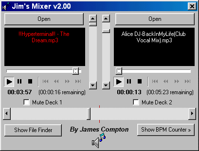



## Mixer with crossfader \- V2\.00

### Description

This is my contribution to all these mixing programs out there. This one has a crossfader that you control, volume control and the track names turn red when there is less than 20 seconds left in a track.

This update includes:

- BPM Counter

- Drag and drop ability (i.e. Windows Explorer)

- File find form to help changing tracks

- Time elapsed and time remaining display
 
### More Info
 

             |
---                |---
**Submitted On**   |2000-07-27 17:32:50
**By**             |[James Compton](https://github.com/Planet-Source-Code/PSCIndex/blob/master/ByAuthor/james-compton.md)
**Level**          |Beginner
**User Rating**    |5.0 (10 globes from 2 users)
**Compatibility**  |VB 5\.0
**Category**       |[Complete Applications](https://github.com/Planet-Source-Code/PSCIndex/blob/master/ByCategory/complete-applications__1-27.md)
**World**          |[Visual Basic](https://github.com/Planet-Source-Code/PSCIndex/blob/master/ByWorld/visual-basic.md)
**Archive File**   |[CODE\_UPLOAD82437272000\.zip](https://github.com/Planet-Source-Code/james-compton-mixer-with-crossfader-v2-00__1-10101/archive/master.zip)

